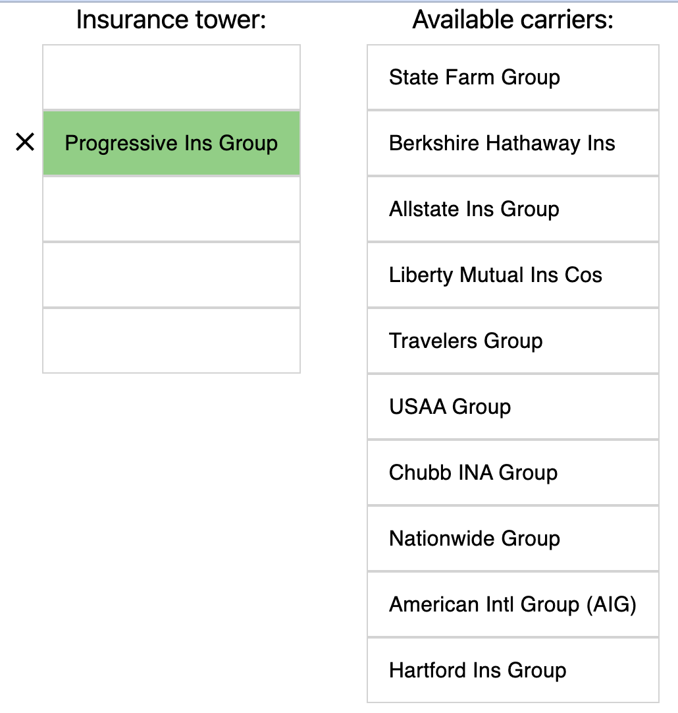

The project's building blocks and assumptions:
1. Created with nextjs create app
   1. The server resides under `pages/api`
2. The persistency is done using [prisma](https://www.prisma.io/) ORM over sqlite 
   1. The initial data is persisted
   2. The data itslef is located under `prisma/dev.db`

## Work-of-art design:


## To run
```bash
npm install
npm run dev
```

Open [http://localhost:3000](http://localhost:3000) in the browser.
